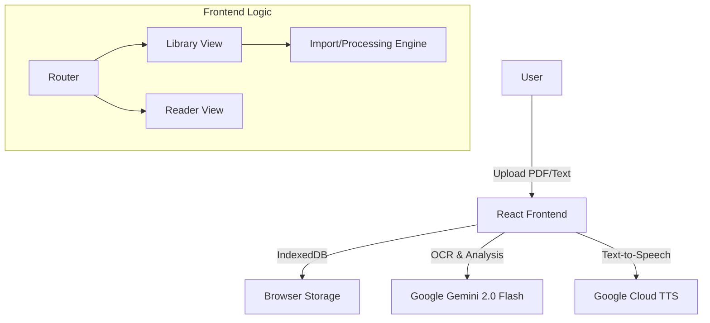

# Architecture Overview

Livre Magique is a client-side heavy application that leverages powerful cloud APIs (Gemini & Google Cloud TTS) while keeping user data local.

## 🏗️ High-Level Component Diagram

## 🧠 Core Services

### 1. Gemini Service (`services/geminiService.ts`)
This is the brain of the application. It handles:
- **Image Analysis**: Sends base64 encoded canvas captures of PDF pages to Gemini.
- **Multimodal Prompting**: Uses specialized system instructions to extract French text, ignore English translations (if present on the page), and generate new translations.
- **Smart Segmentation**: For raw text files, it uses the LLM to intelligently break text into logical "pages" based on narrative flow.
- **Audio Synthesis**: Orchestrates calls to Google Cloud's Neural2 TTS engine.

### 2. Database Service (`services/dbService.ts`)
A lightweight wrapper around `IndexedDB` that manages:
- **Books**: Stores the full JSON structure of processed books, including base64 images and audio.
- **Privacy**: Ensures all copyrightable material (images/text from PDFs) stays on the user's device and isn't stored on a centralized backend.

### 3. Audio Pipeline
The app features a hybrid audio system:
- **Cloud TTS**: High-quality pre-generated audio stored as base64 in IndexedDB.
- **Playback**: Uses the Web Audio API to decode linear16 PCM data from Google Cloud TTS.
- **Visualization**: Tracks playback time to highlight text karaoke-style (currently estimated via linear interpolation).

## 🔄 Data Flow: The Import Process

1. **Input**: User selects a PDF.
2. **Rendering**: `pdf.js` renders each page to a hidden HTML Canvas.
3. **Capture**: The canvas is converted to a JPEG blob.
4. **Analysis**: 
   - The blob is sent to Gemini 2.0 Flash.
   - Gemini returns a structured JSON object (Title, Sentences, Key Vocabulary).
5. **Enrichment**:
   - The simplified French text is sent to Google Cloud TTS.
   - Audio data is returned and attached to the page object.
6. **Storage**: The complete "Magic Book" object is saved to IndexedDB.
